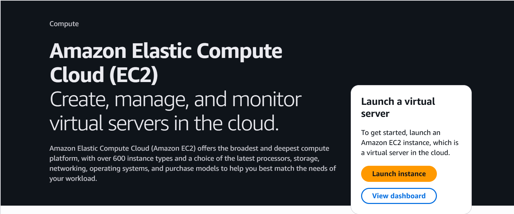
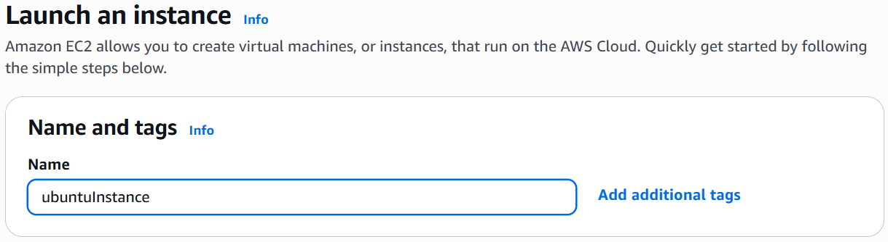
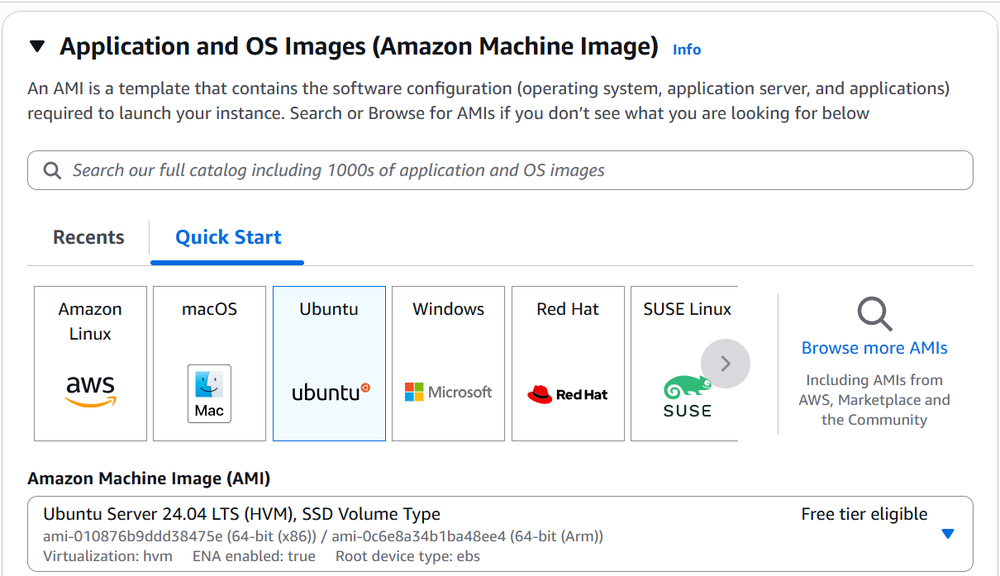
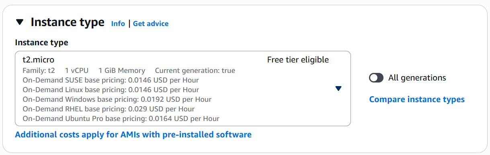
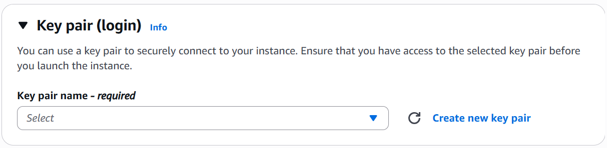
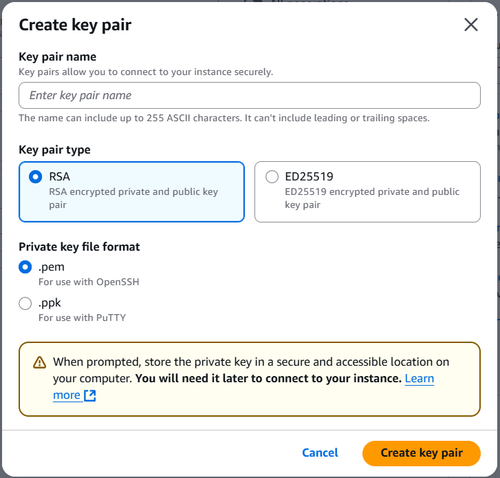
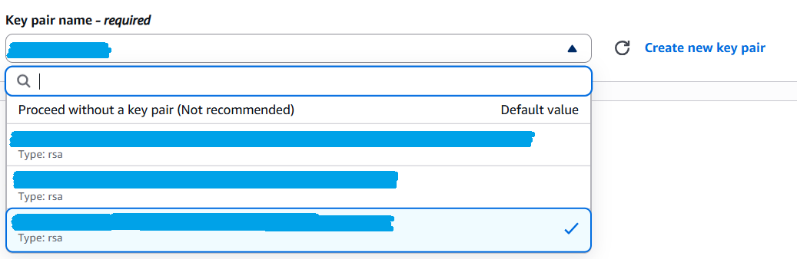
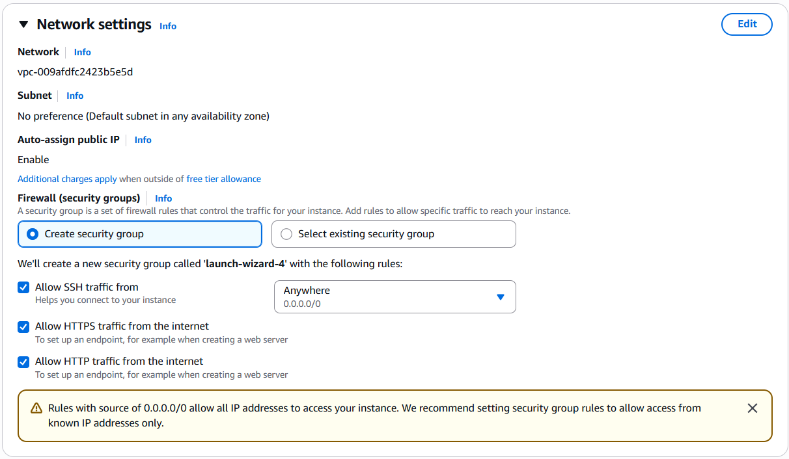
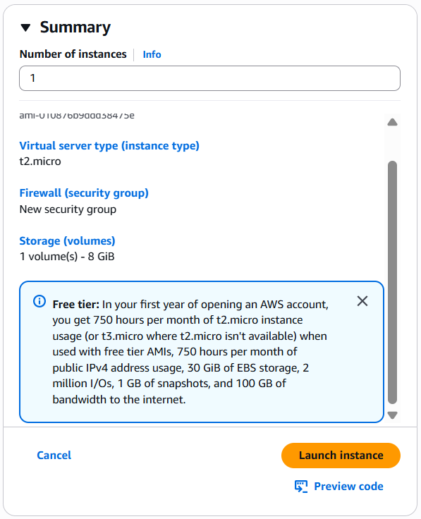
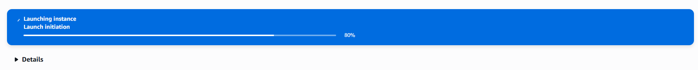

1. Akses link berikut: https://console.aws.amazon.com/ec2/home

2. Klik tombol `Launch instance`

3. Masukkan nama dari `Instance`

4. Pilih OS yang digunakan pada `Instance`

5. Pilih `Instance type` yang memiliki **Free tier eligible**

6. Pilih atau buat `Key pair` untuk nantinya digunakan untuk terhubung ke `Instance` melalui **SSH**

7. Buat `Key pair` dengan mengisi nama **Key pair** (`Key pair name`), tipe **Key pair** (`Key pair type`) pilih RSA, format file (`Private key file format`) pilih `.pem` dan terakhir klik tombol `Create key pair`. Simpan file `Key pair` ke lokasi tertentu (`simpan pada C:\Users\[user_pada_komputer]`)

8. Kita juga dapat memilih `Key pair` jika sudah memiliki **Key pair** sebelumnya

9.  Buat `Network settings` pada `Firewall (security group)` pilih `Allow SSH traffic from`, `Allow HTTPS traffic from the internet`, dan `Allow HTTP traffic from the internet`.

10. Klik tombol `Launch instance` untuk membuat `Instance`.

