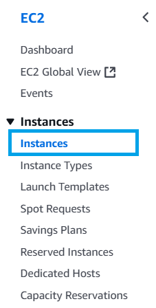
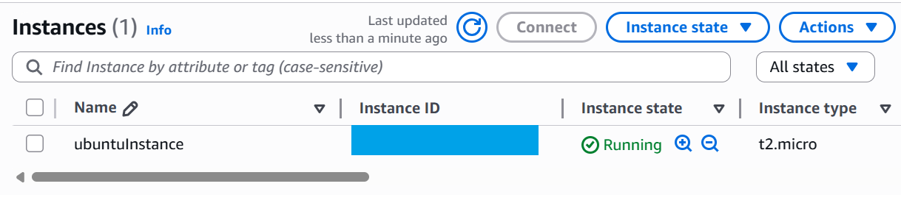
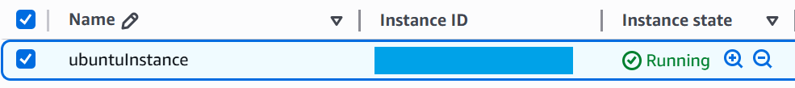
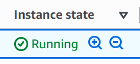
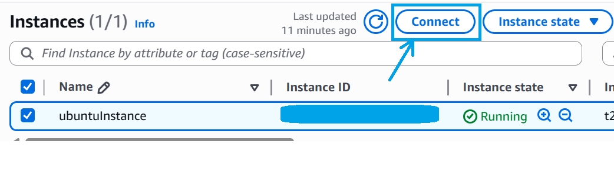
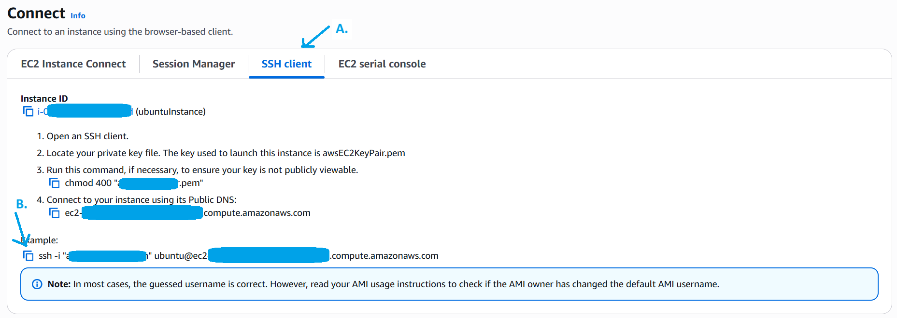
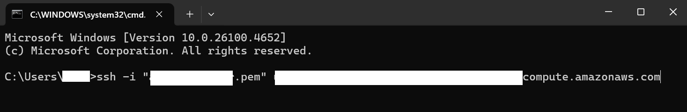
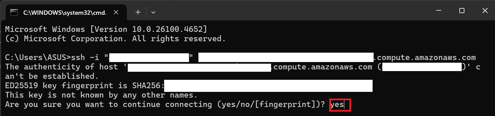
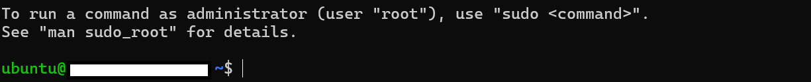
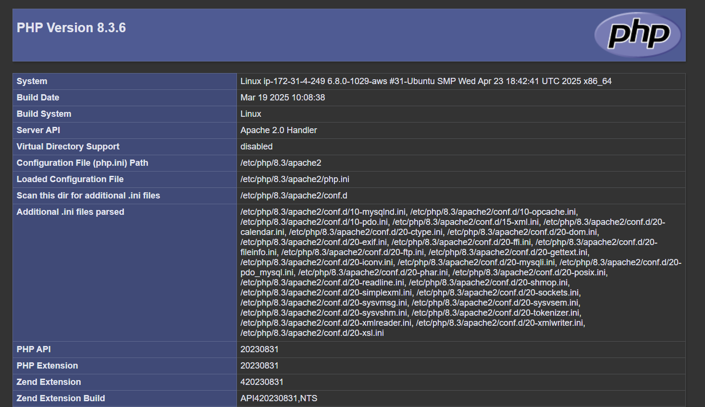

1. Akses ke menu `Instance`. 


2. Pada halaman `Instance` pilih salah satu **Instance** yang akan dihubungkan. (Pastikan **Instance** yang akan dihubungkan berada pada status `Running` )

    
    
    
    

3. Pada halaman `Connect` pilih Tab SSH client copy script `ssh -i "***.pem" ***@***.***.compute.amazonaws.com`

    

4. Buka `Command Prompt` dan **paste** script yang kita copy sebelumnya, tekan **Enter** dan ketik `yes` kemudian tekan **Enter**. 

    
    
    

5. Ketik perintah berikut pada terminal `Command Prompt`
    ```bash
    sudo apt update && sudo apt upgrade -y
    ```

6. Install Apache 2, PHP, Git dengan perintah berikut:
    ```bash 
    sudo apt install apache2 php php-common php-xml php-mysql git unzip -y
    ```

7. Cek service Apache 2 dengan perintah berikut: 
    ```bash
    sudo systemctl status apache2
    ```
    Jika service belum berjalan atau `inactive` jalankan perintah berikut:
    ```bash
    sudo systemctl enable apache2 && sudo systemctl start apache2
    ```

8. Cek versi PHP dengan perintah berikut:
    ```bash
    php -v
    ```

9. Cek versi Git dengan perintah berikut:
    ```bash
    git -v
    ```

10. Ubah kepemilikan direktori `/var/www/html` dengan perintah berikut:
    ```bash
    sudo chown -R ubuntu:ubuntu /var/www/html 
    ```
11. Ubah izin akses pada direktori `/var/www/html` dengan perintah berikut:
    ```bash
    sudo chmod -R 755 /var/www/html
    ```

12. Uji PHP, pindah ke direktori `/var/www/html` dengan perintah berikut:
    ```bash
    cd /var/www/html
    ```
    Kemudian jalankan perintah berikut:
    ```bash
    echo "<?php phpinfo(); ?>" > phpinfo.php
    ```
    Uji dengan mengakses ip publik dari **Instance** `http://[ip_public]/phpinfo.php`

    Jika berhasil akan muncul tampilan seperti gambar berikut:
    
